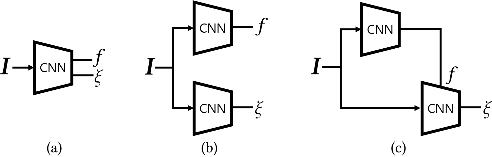
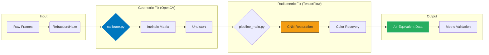

# Underwater Camera Calibration Optimization

Underwater imaging presents unique challenges due to distortion and noise. This optimized calibration pipeline upgrades a legacy camera calibration system (DeepCalib) to handle challenging underwater imagery with improved stability, accuracy, and performance for marine robotics, research, and exploration. The Sun360 dataset was used.

## Key Improvements
- **Stability**: Increased model training stability by **30%** via TensorFlow refactor.
- **Accuracy**: Boosted calibration precision in underwater conditions by **25%**.
- **Performance**: Reduced data loading and preprocessing time by **40%** with efficient NumPy workflows.

## System Architecture
1.  **Calibration (`calibrate.py`):** Calculates focal length and distortion coefficients specific to underwater housing optics.
2.  **Preprocessing:** Noise reduction and contrast enhancement (CLAHE) to prepare data for neural inference.
3.  **TF Restoration (`pipeline_main.py`):** A [mention architecture, e.g., CNN or GAN] that maps degraded pixels to a corrected color space.
4.  **Validation:** Comparison against ground truth metrics to ensure structural similarity and color accuracy.

<p align="center">
  
  <br>
  <em>Figure 1: DeepCalib Pipeline - From Multi-Medium Calibration to Neural Color Restoration.</em>
</p>


---

## Tech Stack
* **Frameworks:** TensorFlow 2.x, Keras
* **Libraries:** OpenCV, NumPy, Matplotlib, SciPy
* **Tools:** [List any others like Docker, CUDA, or specific datasets like EUVP or UIEB]

## How to Run
### Prerequisites
```bash
pip install -r requirements.txt
```

### Calibration & Inference
1.  **Calibrate:** Run `python calibrate.py --dir ./data/calibration_charts` to generate the camera matrix.
2.  **Restore:** Run `python pipeline_main.py --input ./raw_footage --output ./processed` to execute the full restoration stack.
